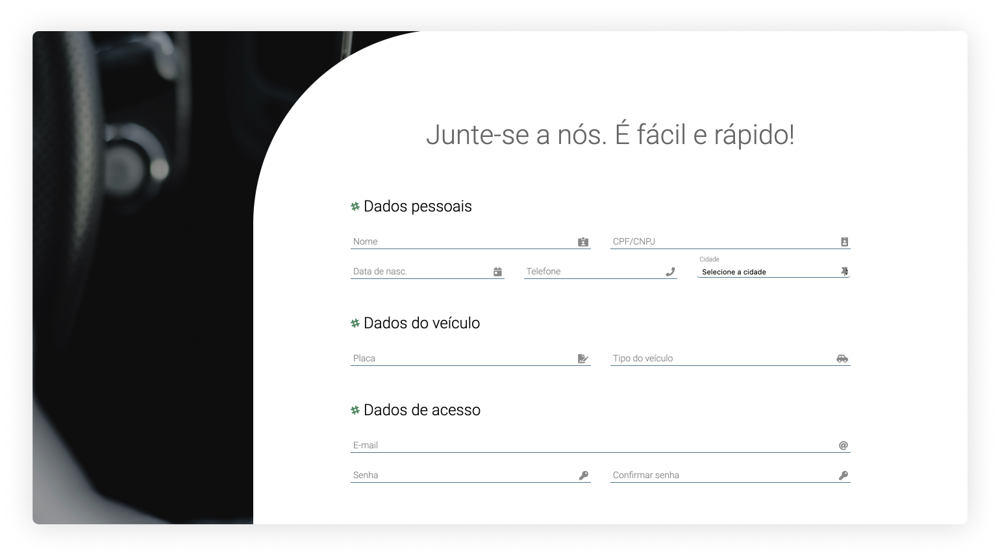
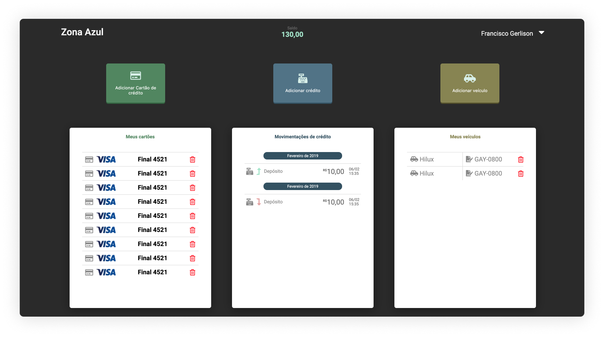

# Car Park


This project is a study about vanilla HTML and CSS.
A set of web pages for a car park system, where the user could register, login, and manage your parking tickets.

## Table of Contents

 * [Installation](#installation)
    + [Cloning the repository](#cloning-the-repository)
    + [Running](#running)
 * [Screenshots](#screenshots)
 * [Contributing](#contributing)
    + [Create a fork](#create-a-fork)
    + [Git Flow](#git-flow)
    + [Open a Pull Request](#open-a-pull-request)

## Installation

### Cloning the repository

Clearly you'll need [git](https://git-scm.com/book/en/v2/Getting-Started-Installing-Git) installed on your machine.
Navigate to a directory of your choice and clone the repository.

```bash
  git clone https://...
```

### Running

Just open the file `login.html` on your browser.


## Screenshots

| | | |
|:-------------------------:|:-------------------------:|:-------------------------:|
|||

## Contributing

### Create a fork

To contribute to a open source project, you can do a fork from the source code, do your own changes on a copy without compromising the original.

If you don't know how to do that, follow this [guide](https://help.github.com/pt/github/getting-started-with-github/fork-a-repo).

### Git Flow

_GitFlow is a branching model for Git, created by Vincent Driessen. It has attracted a lot of attention because it is very well suited to collaboration and scaling the development team._

So, in my projects I always try to use that. It's very useful and helps to control what is happing to the code base.

Read a little bit more [about this](https://datasift.github.io/gitflow/IntroducingGitFlow.html).

### Open a Pull Request

With all your changes done, and you are ready to contribute, open a pull request to the _upstream_ `develop` branch. Your PR will be analysed, discuted and aproved gratefuly.

> About [pull requests](https://help.github.com/pt/github/collaborating-with-issues-and-pull-requests/about-pull-requests)


